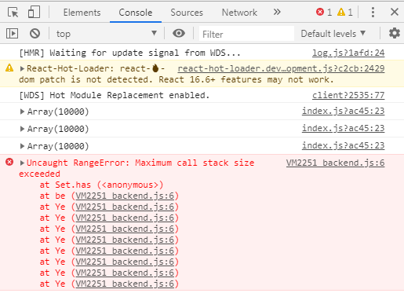

# 场景介绍

模拟弹幕业务场景，通过socket-io向前端推送数据，每次推送10000条数据，总共推送3次，然后前端去处理渲染弹幕

# 思路
首先，肯定不能拿到10000条数据，就直接在react中进行setState，这样会一帧直接渲染10000条弹幕dom，会导致内存溢出

增加缓冲池，通过requestAnimationFrame这个API去一条条或者一批一批的渲染弹幕；并增加策略，同时存在弹幕列表的dom最多只有200条，超过200条就删除，这样子的页面性能就会好很多。
